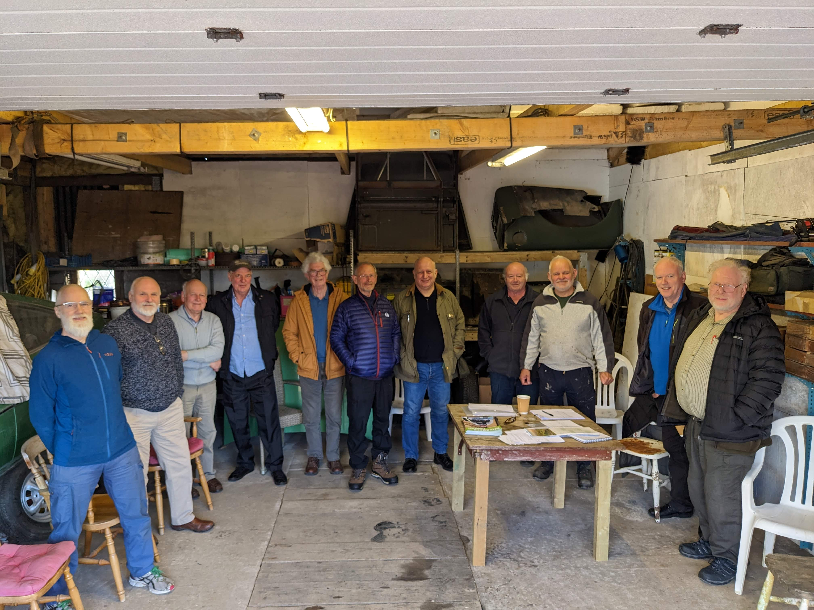

# Shedders Update 

Hi all, another good turnout for the committee meeting held at 2, Gowanbank Leadhills all the points raised and discussed are listed below. 

## 1: Bank Account 

It was agreed that we ask Paul Creechan the Men’s Shed Development Worker to come to Nigel’s house to help the four members, who will be signatories for the account, to make an application online. Paul has carried out this procedure for other Men’s Shed before and knows his way round the Paperwork. His visit will be confirmed. 

## 2: Ownership of the Ski Building 

Nigel sent an email to Martin Docherty a director of the ski club asking about the transferring the ownership of the building to L&DMS copingy in Donald Noble of Hopetoun Estates, Donald replied that he was not sure of the legal position, but would be happy to (if required) to transfer or facilitate ownership to L&DMS. 

Again, many thanks to Donald for his help. 

## 3: Scottish Power 

Donald Noble, Factor Hopetoun Estates has updated L&DMS regarding the moving of the overhead power lines running across the site of the Proposed Men’s Shed in Ramsay Road. Scottish Power are now in the stages of planning a new underground route. 

We thank Scottish Power and Hopetoun Estates for their help to overcome this problem. 

## 4: Planning Application through S.L.C. 

We are in the process of filing for planning permission to erect the Men’s Shed in Ramsay Road Leadhills. Unfortunately, this will be a long process, so please bear with us, we will keep you posted. 

## 5: Next Meeting 

Will be held 9th June 6:30 pm at 2 Gowanbank, Leadhills. ML12 6YB all Welcome. If you need directions Phone Nigel: 07766264455 
Come and have a coffee and a chat. 

## 6: Meeting closed. 

