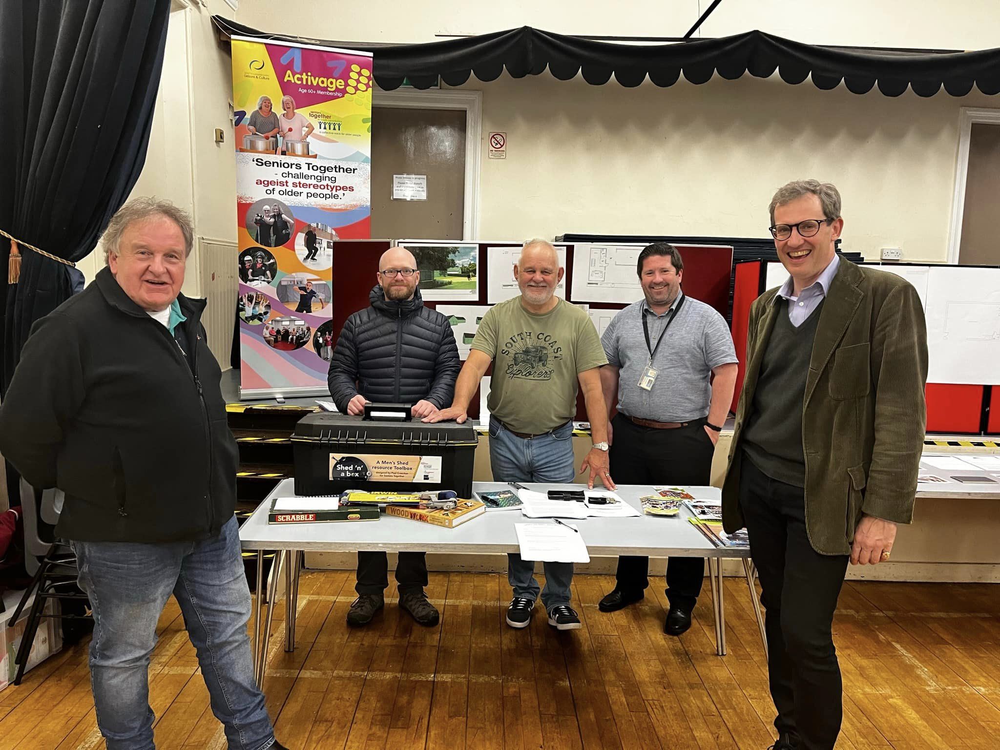

## Hopetoun Estates Annual Community Consultation 
### 10th October 2023  

Hopetoun estates invited L&DMS to join them in the Leadhills village hall, which was greatly accepted, this gave us a good opportunity to promote the Lowther & District Men’s Shed and be a part of the District Roadshows. 

Bob Lowdon, myself, and Paul Creechan who travelled down from Hamilton to help with promotional literature, popup, and a shedders toolbox, we had sketches of the shed, the site in Ramsay Road, the whole thing looked great, a little later Bruce and Ewan committee members came down to help.

The afternoon and evening were very busy, with a great deal of interest and support for the Shed project, many of which were woman. 

We gained several new members including Lord Andrew Hopetoun, who on visiting our table said it was a great opportunity for the community. 

Lowther & District Men’s Shed would like to thank Hopetoun Estates for the invitation, and there help and ongoing support. 

Also, many thanks to Paul Creechan for his time in helping to promote the L&DMS. 

It was a great and informative night for the village, well done to all. 

We have a date for the Crawford village Hall Roadshow promoting the L&DMS 9th November 2pm-4:30pm, free soup, rolls, sweet treats + tea & coffee. 

Please try and call in your support would be greatly Appreciated. 

Nigel.
