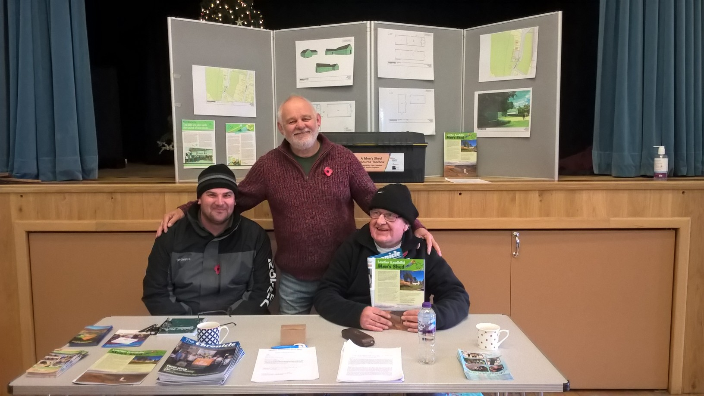

### Lowther and District Men's Shed

Hi all, another great afternoon at Crawford village hall promoting Lowther & District Men's Shed. This is our second roadshow Leadhills being the first, very well supported at the table with Bob,Nathan, and myself setting up, Bruce and George talking to potential members gaining four on the day with many taking info home.

There were a good number of women visiting the table very interested with our project looking over our plans, and picking up our information.

We would like to thank Bruce of arranging the venue and Lyndsey for allowing us to join the coffee afternoon. We will be back.

There will be further Roadshows in the district, I will keep you all informed.

Nigel, Secretary L&DMS